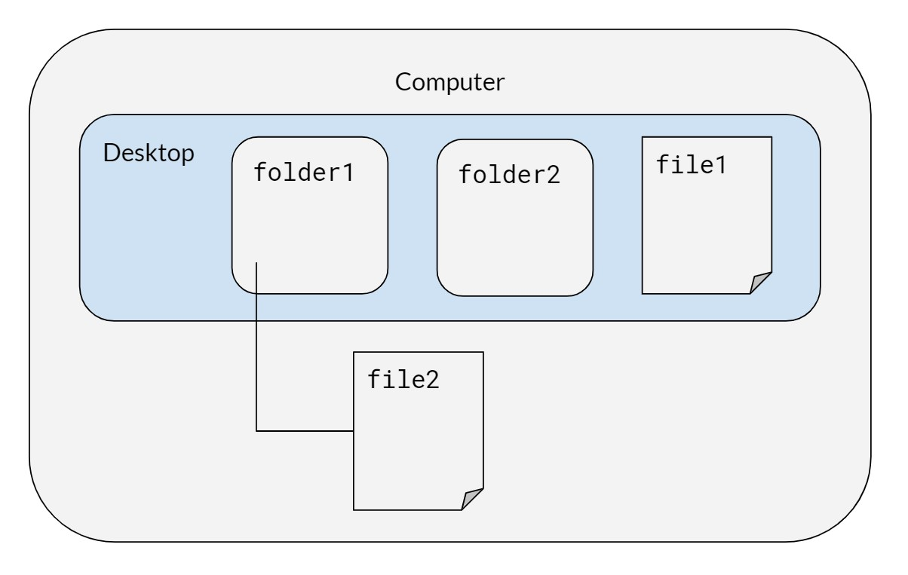

# Unix commands {#unix}

by Stephanie Djajadi and Kunal Mishra

We typically use Unix commands in Terminal (for Mac users) or Git Bash (for Windows users) to 

1. Run a series of scripts in parallel or in a specific order to reproduce our work
2. To check on the progress of a batch of jobs
3. To use git and push to github 

## Basics

On the computer, there is a desktop with two folders, `folder1` and `folder2`, and a file called `file1.` Inside `folder1`, we have a file called `file2.` Mac users can run these commands on their terminal; it is recommended that Windows users use Git Bash, not Windows PowerShell.

## Syntax for both Mac/Windows
When typing in directories or file names, quotes are necessary if the name includes spaces.

| Command | Description |
|---------|-------------|
| `cd desktop/folder1`    | Change directory to `folder1` |
| `pwd`                   | Print working directory |
| `ls`                    | List files in the directory |
| `cp "file2" "newfile2"` | Copy file (remember to include file extensions when typing in file names like `.pdf` or `.R`) |
| `mv “newfile2” “file3”` | Rename `newfile2` to `file3` |
| `cd ..`                 | Go to parent of the working directory (in this case, `desktop`) |
| `mv “file1” folder2`    | Move `file1` to `folder2` |
| `mkdir folder3`         | Make a new folder in `folder2` |
| `rm <filename>`         | Remove files |
| `rm -rf folder3`        | Remove directories (`-r` will attempt to remove the directory recursively, `-rf` will force removal of the directory) |
| `clear`                 | Clear terminal screen of all previous commands |

## Running Bash Scripts

| Windows | Mac / Linux | Description |
|---------|-------------|-------------|
|`chmod +750 <filename.sh>` | `chmod +x <filename.sh>` | Change access permissions for a file (only needs to be done once) |
| `./<filename.sh>` | `./<filename.sh>` | Run file (`./` to run any executable file) |
| `bash bash_script_name.sh &` | `bash bash_script_name.sh &` | Run shell script in the background |

## Running Rscripts
**Stephanie please reformat below**
`Rscript file.R`
`R CMD BATCH file.R`	# output will be in a new file called file.Rout
`cat file.Rout` 		# check output
http://datacornering.com/how-to-run-r-scripts-from-the-windows-command-line-cmd/
https://happygitwithr.com/shell.html

## Checking tasks and killing jobs

| Windows | Mac / Linux | Description |
|---------|-------------|-------------|
| `tasklist` | `ps -v`       | List all processes on the command line |
| | `top -o [cpu/rsize]`  | List all running processes, sorted by CPU or memory usage |
| `taskkill /F /PID pid_number` | `kill <PID_number>` | Kill a process by its process ID|
| `taskkill /IM "process name" /F`|   | Kill a process by its name |
| `start /b program.exe` | | Runs jobs in the background (exclude `/b` if you want the program to run in a new console) |
| | `nohup` | Prevents jobs from stopping |
| | `disown` | Keeps jobs running in the background even if you close R |
| `taskkill /?` | | Help, lists out other commands |

## Running big jobs

For big data workflows, the concept of "backgrounding" a bash script allows you to start a "job" (i.e. run the script) and leave it overnight to run. At the top level, a bash script (`0-run-project.sh`) that simply calls the directory-level bash scripts (i.e. `0-prep-data.sh`,  `0-run-analysis.sh`, `0-run-figures.sh`, etc.) is a powerful tool to rerun every script in your project. See the included example bash scripts for more details.

- **Running Bash Scripts in Background**: Running a long bash script is not trivial. Normally you would run a bash script by opening a terminal and typing something like `./run-project.sh`. But what if you leave your computer, log out of your server, or close the terminal? Normally, the bash script will exit and fail to complete. To run it in background, type `./run-project.sh &; disown`. You can see the job running (and CPU utilization) with the command `top` or `ps -v` and check your memory with `free -h`.

- **Deleting Previously Computed Results**: One helpful lesson we've learned is that your bash scripts should remove previous results (computed and saved by scripts run at a previous time) so that you never mix results from one run with a previous run. This can happen when an R script errors out before saving its result, and can be difficult to catch because your previously saved result exists (leading you to believe everything ran correctly).

- **Ensuring Things Ran Correctly**: You should check the `.Rout` files generated by the R scripts run by your bash scripts for errors once things are run. A utility file is include in this repository, called `runFileSaveLogs`, and is used by the example bash scripts to... run files and save the generated logs. It is an awesome utility and one I definitely recommend using. For help and documentation, you can use the command `./runFileSaveLogs -h`.
